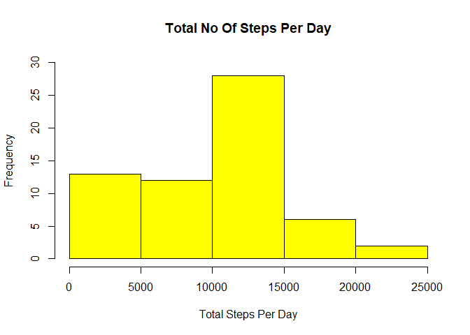
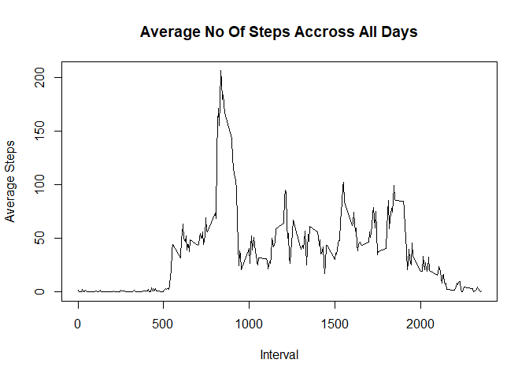
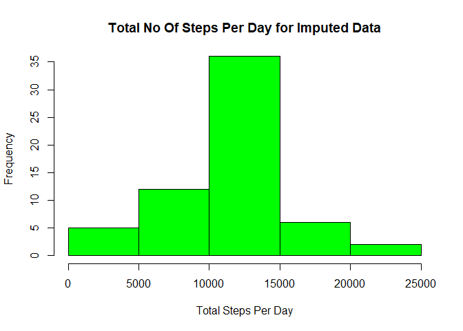

# Reproducible Research: Peer Assessment 1


## Loading and preprocessing the data

1.Code for reading in the dataset and/or processing the data


```r
library(lattice)
library(timeDate)
library(dplyr)
library(ggplot2)
```


```r
if(!file.exists('activity.csv'))
  {
      unzip('activity.zip')
  }
activity_data <- read.csv("activity.csv")
```

## What is mean total number of steps taken per day?

1.Calculate the total number of steps taken per day


```r
Totalsteps_perday <- aggregate(activity_data$steps,
                     list(activity_data$date), sum, na.rm= TRUE)

colnames(Totalsteps_perday) <- c("Date", "Steps")
```

2.Make a histogram of the total number of steps taken each day


```r
hist(Totalsteps_perday$Steps, 
     ylim = c(0,30) ,
     xlab = "Total Steps Per Day", 
     col = "yellow", 
     main = "Total No Of Steps Per Day")
```

<!-- -->


3.Calculate and report the mean and median of the total number of steps taken per day


```r
mean(Totalsteps_perday$Steps) 
```

```
## [1] 9354.23
```

```r
median(Totalsteps_perday$Steps)
```

```
## [1] 10395
```

## What is the average daily activity pattern?

1.Make a time series plot (i.e. type = "l") of the 5-minute interval (x-axis) and the average number of steps taken, averaged across all days (y-axis)


```r
aggregate(steps~interval, activity_data ,mean) -> avgsteps_interval

plot(avgsteps_interval$interval, avgsteps_interval$steps,
     type = "l", 
     xlab = "Interval",
     ylab="Average Steps", 
     main = "Average No Of Steps Accross All Days")
```

<!-- -->


2.Which 5-minute interval, on average across all the days in the dataset, contains the maximum number of steps?


```r
max_interval <-
  avgsteps_interval[which.max(avgsteps_interval$steps),1]
max_interval
```

```
## [1] 835
```

## Imputing missing values

1.Calculate and report the total number of missing values in the dataset (i.e. the total number of rows with NAs)


```r
sum(is.na(activity_data))
```

```
## [1] 2304
```

2.Devise a strategy for filling in all of the missing values in the dataset.

Strategy is to impute the missing values with mean for that 5      minute interval.
 
 
 3.Create a new dataset that is equal to the original dataset but with the missing data filled in.


```r
imputed_data <- activity_data
imputed_data$steps[is.na(imputed_data$steps)] <-      avgsteps_interval$steps[match(imputed_data$interval,  avgsteps_interval$interval)][which(is.na(imputed_data$steps))]
```

4.Make a histogram of the total number of steps taken each day and Calculate and report the mean and median total number of steps taken per day. 


```r
impute_totalsteps <- aggregate(imputed_data$steps,
                   list(imputed_data$date), sum, na.rm= TRUE)
colnames(impute_totalsteps) <- c("Date", "Steps")

hist(impute_totalsteps$Steps, 
     ylim = c(0,35) ,
     xlab = "Total Steps Per Day",
     col = "green", 
     main = "Total No Of Steps Per Day for Imputed Data")
```

<!-- -->


```r
mean(impute_totalsteps$Steps)
```

```
## [1] 10766.19
```

```r
median(impute_totalsteps$Steps)
```

```
## [1] 10766.19
```

## Are there differences in activity patterns between weekdays and weekends?

1.Create a new factor variable in the dataset with two levels - "weekday" and "weekend" indicating whether a given date is a weekday or weekend day.


```r
activity_data$day <- ifelse(isWeekday(activity_data$date),"Weekday", "Weekend")
```
2.Make a panel plot containing a time series plot (i.e. type = "l") of the 5-minute interval (x-axis) and the average number of steps taken, averaged across all weekday days or weekend days (y-axis). 


```r
aggregate(steps~(interval+day), activity_data, mean)->mean_data
 
xyplot(steps~interval|day, 
       data = mean_data, 
       type = "l", 
       main = "Average Steps Per Interval", 
       layout = c(1,2))
```

<!-- -->
